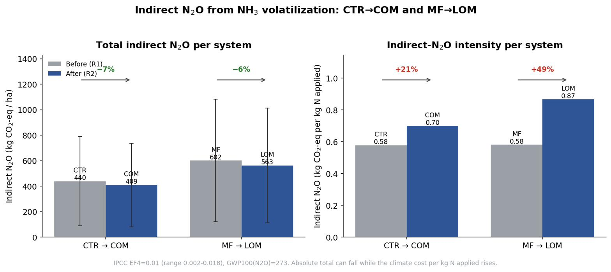

# Trajectoire — Ammonia Volatilization & Indirect N₂O

Reproducible modelling of ammonia (NH₃) volatilization from the seven cropping systems of the
**Trajectoire** experimental platform (2018–2025), its translation into indirect nitrous oxide
(N₂O), and a sensitivity analysis. The workflow combines the emission-factor–based **EMEP/EEA
Tier 2** method (absolute inventory) with the semi-empirical **ALFAM2** model (emission intensity
resolved by application method and weather), and evaluates the effect of transitioning two systems
to methanized digestate fertilization (CTR→COM, MF→LOM).

<p align="center">
  
</p>

## Key results

- Corrected inventory: **1,125.5 kg NH₃-N ha⁻¹** across 152 events (≈ **4,830 kg CO₂-eq ha⁻¹** of
  indirect N₂O).
- The transition to digestate does not reduce emissions per se: absolute totals fall only because
  less nitrogen is applied over a shorter record, while **intensity rises (+21 % to +49 %)**.
- EMEP Tier 2 and ALFAM2 **agree** (ratio ≈ 1.0) once EMEP's band-spreading abatement is applied.
- **Band application** of digestate is the main mitigation lever: ≈ 30 kg NH₃-N ha⁻¹
  (≈ 130 kg CO₂-eq) avoided for the events studied (verified by a real ALFAM2 re-run).

## Repository structure

```
trajectoire-nh3/
├── data/
│   ├── raw/                     Source event databases (152 events; both rotations)
│   └── alfam2/                  ALFAM2 model inputs (workbook + hourly CSV)
├── src/
│   ├── pipeline/                Data processing and modelling (steps 1–9, Python + R)
│   └── analysis/                Figures, sensitivity, indirect-N₂O, ALFAM2 re-run
├── figures/                     Report figures (PNG) + CAPTIONS.md
├── results/
│   ├── emep/                    EMEP Tier 2 inventory (first / second rotation)
│   ├── alfam2/                  ALFAM2 per-event and hourly outputs
│   ├── comparison/              EMEP vs ALFAM2 per-event tables
│   ├── sensitivity_and_n2o/     Sensitivity and indirect-N₂O tables
│   └── alfam2_rerun/            ALFAM2 reproduction + band counterfactual
├── report/                      Full report and executive summary (DOCX)
├── requirements.txt             Python dependencies
├── install.R                    R dependencies (ALFAM2)
├── run_all.sh                   End-to-end reproduction script
├── CITATION.cff                 Citation metadata
└── LICENSE
```

## Installation

**Python** (3.10+):

```bash
pip install -r requirements.txt
```

**R** (4.3+):

```bash
Rscript install.R
```

`install.R` installs the `ALFAM2` package (used with parameter set 3) and `Rcpp`.

## Reproducing the analysis

Run the full pipeline from the repository root:

```bash
bash run_all.sh
```

Or run individual steps, for example:

```bash
# EMEP Tier 2 inventory (full + both rotations)
python src/pipeline/2_run_emep_tier2.py --inputs data/raw/DB_plain_clean.xlsx \
    data/raw/DB_first_rotation.xlsx data/raw/DB_second_rotation.xlsx

# Indirect N2O + sensitivity for the full inventory
python src/analysis/sensitivity_and_indirect_n2o.py \
    --input results/emep/second_rotation/events_emep.csv --outdir results --scope "second rotation"

# Real ALFAM2 band-application counterfactual
Rscript src/analysis/alfam2_counterfactual.R
```

The analysis scripts accept `--input`, `--outdir` and `--scope` arguments and can be run for any
rotation or for the full inventory.

## Methods and emission factors

| Quantity | Value | Source |
|---|---|---|
| Organic EF (slurry, liquid digestate) | 0.55 of TAN (surface reference) | EMEP/EEA 2023 |
| Organic EF (solid manure) | 0.68 of TAN | EMEP/EEA 2023 |
| Mineral EF (UAN / Urea / Thiosulphate / Entec / Amm. nitrate) | 0.133 / 0.170 / 0.154 / 0.090 / 0.043 of TAN | EMEP/EEA 2023 |
| Band-spreading abatement | ≈ 30 % | EMEP/EEA 2023 |
| EF4 (indirect N₂O) | 0.010 (0.002–0.018) kg N₂O-N / kg N volatilized | IPCC 2019 |
| GWP₁₀₀(N₂O) | 273 | IPCC 2021 |
| ALFAM2 parameters | Set 3 (central) | Hafner et al. 2019 |

Full methods, results and discussion are in [`report/Trajectoire_NH3_report.docx`](report/Trajectoire_NH3_report.docx);
a one-page summary is in [`report/Executive_Summary.docx`](report/Executive_Summary.docx).

## Citation

If you use this work, please cite it (see [`CITATION.cff`](CITATION.cff)):

> Zúñiga-Jiménez, D. (2026). *Modelling Ammonia Volatilization and Indirect Nitrous Oxide across
> the Cropping Systems of the Trajectoire Platform.* AgroParisTech.

## License

Code is released under the MIT License (see [`LICENSE`](LICENSE)). The report, figures and data are
shared for academic use; please attribute the author.

## Contact

Daniela Zúñiga-Jiménez 
